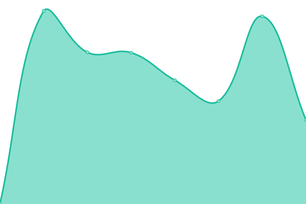
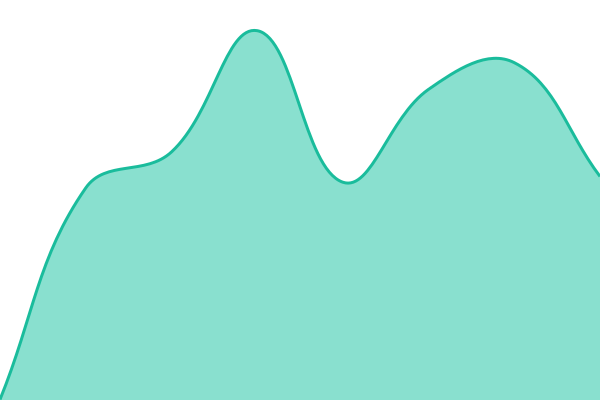
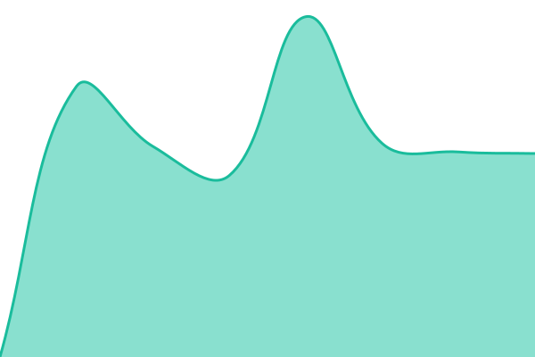
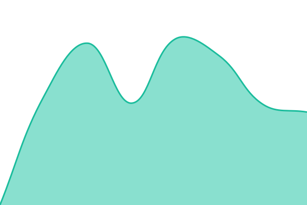
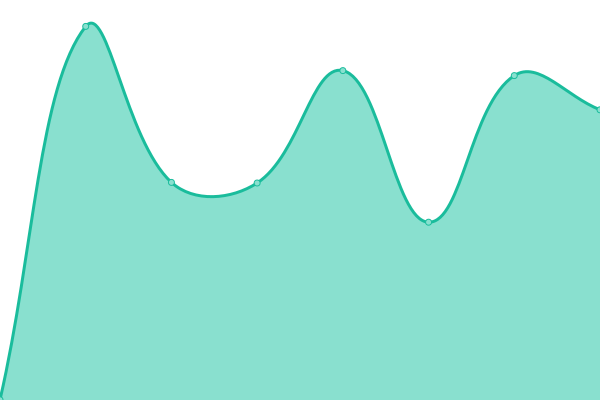

# [📈 Live Status](https://Allaman.github.io/status): <!--live status--> **🟩 All systems operational**

<!--start: status pages-->
<!-- This summary is generated by Upptime (https://github.com/upptime/upptime) -->
<!-- Do not edit this manually, your changes will be overwritten -->
<!-- prettier-ignore -->
| URL | Status | History | Response Time | Uptime |
| --- | ------ | ------- | ------------- | ------ |
|  [mijope.de](https://mijope.de) | 🟩 Up | [mijope-de.yml](https://github.com/Allaman/status/commits/HEAD/history/mijope-de.yml) | 

 378ms
     
 | 

<a href="https://Allaman.github.io/status/history/mijope-de">100.00%</a>
    

|  [rootknecht.net](https://rootknecht.net) | 🟩 Up | [rootknecht-net.yml](https://github.com/Allaman/status/commits/HEAD/history/rootknecht-net.yml) | 

 1112ms
     
 | 

<a href="https://Allaman.github.io/status/history/rootknecht-net">99.63%</a>
    

|  Syncthing | 🟩 Up | [syncthing.yml](https://github.com/Allaman/status/commits/HEAD/history/syncthing.yml) | 

 1423ms
     
 | 

<a href="https://Allaman.github.io/status/history/syncthing">99.63%</a>
    

|  Timetrack | 🟩 Up | [timetrack.yml](https://github.com/Allaman/status/commits/HEAD/history/timetrack.yml) | 

 750ms
     
 | 

<a href="https://Allaman.github.io/status/history/timetrack">100.00%</a>
    

|  Git | 🟩 Up | [git.yml](https://github.com/Allaman/status/commits/HEAD/history/git.yml) | 

 1260ms
     
 | 

<a href="https://Allaman.github.io/status/history/git">99.63%</a>
    

|  RSS | 🟩 Up | [rss.yml](https://github.com/Allaman/status/commits/HEAD/history/rss.yml) | 

 1201ms
     
 | 

<a href="https://Allaman.github.io/status/history/rss">99.63%</a>
    

|  Cloud | 🟩 Up | [cloud.yml](https://github.com/Allaman/status/commits/HEAD/history/cloud.yml) | 

 1289ms
     
 | 

<a href="https://Allaman.github.io/status/history/cloud">99.52%</a>
    

|  Library | 🟩 Up | [library.yml](https://github.com/Allaman/status/commits/HEAD/history/library.yml) | 

 1256ms
     
 | 

<a href="https://Allaman.github.io/status/history/library">99.63%</a>
    

<!--end: status pages-->

[**Visit our status website →**](https://Allaman.github.io/status)

## 📄 License

- Powered by: [Upptime](https://github.com/upptime/upptime)
- Code: [MIT](./LICENSE) © [Michael Peter](https://github.com/Allaman)
- Data in the `./history` directory: [Open Database License](https://opendatacommons.org/licenses/odbl/1-0/)
